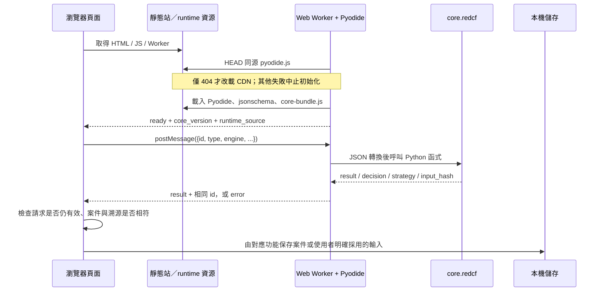

# 驗證機制、請求流程與憑證邊界

檢視日期：2026-09-25。基準：`08097b8e19e575368d561505c2fca844fcd0398c`，另含本次本機備份索引驗證修正。

## 結論

BUILDER 目前**沒有應用程式層的使用者驗證系統**：沒有帳號密碼登入、OAuth callback、JWT 簽發／驗證、refresh token、登入 cookie 或 RBAC。
它的主要入口是 GitHub Pages 靜態站，使用者在自己的瀏覽器運算與儲存案件。
`core/redcf/api.py` 是 Python 函式介面，不是需要 Bearer token 的 HTTP API。

這與 [ARCHITECTURE.md 的 D6 與 §7](../../ARCHITECTURE.md) 及
[安全邊界文件](STRATEGY_SECURITY_BOUNDARIES.md) 一致：目前不建使用者系統與後端服務；
工程執行表將帳號、多租戶及 RBAC 留在 [P3 企業能力](ENGINEER_WORKSHEET-2026-09-14.md)。
本次沒有新增登入或改變這個架構。

## 元件與責任

| 元件 | 程式位置 | 驗證／資料處理責任 |
|---|---|---|
| 靜態介面 | `apps/web/index.html`、四步頁面 | 接收輸入、顯示結果；無登入守門 |
| 案件匯流排 | [case-bus.js](../../apps/web/case-bus.js)：`readStore`、`writeStore`、`activeRecord` | 使用 `localStorage` 的 `uros.workflow.v1` 與 `uros.active_case`；選案是本機狀態，不是權限判斷 |
| 本機資料庫 | [case-store.js](../../apps/web/case-store.js)：`open`、`exportAll` | IndexedDB `uros`，含 `cases`／`activity`／`meta`；案件、活動與版本資料，非登入 session |
| Worker 呼叫端 | [core-runtime.js](../../apps/web/core-runtime.js)：`createCoreRuntime` | 分配請求 ID、管理 Promise、逾時與失敗；使用 `Worker.postMessage` |
| Worker 與 Python | [core-runtime.worker.js](../../apps/web/core-runtime.worker.js) | 載入 Pyodide、Core 與 jsonschema；在瀏覽器呼叫 `recompute`／`decide`／`strategize` 等 |
| 輸入邊界 | [security.js](../../apps/web/security.js) | JSON 容量／深度／項目數限制、危險鍵拒絕、HTML escaping、CSV 公式注入處理；這是資料安全，不是身分驗證 |
| 備份 | [browser-backup.js](../../apps/web/browser-backup.js)：`validate`、`snapshot`、`restore` | 匯出兩種儲存資料；還原前檢查格式與索引，拒絕覆蓋有業務資料的設定檔 |
| Streamlit | [app.py](../../apps/streamlit/app.py)：`main` | 另一條伺服器 Python 執行路徑；`st.session_state` 保存互動狀態，程式未實作登入 |

## 一次計算怎麼走

以 `recompute` 為例：`core-runtime.js` 傳 `{id, type: "recompute", engine}`；
worker 用 `JSON.stringify` 傳入 Python，再呼叫 `_redcf.recompute` 與 `_redcf.input_hash`，
將結果與原 `id` 回傳。這段不是遠端 API 請求，不附登入 token。
執行環境下載是網路請求；目前程式沒有將案件 payload 加進這些下載請求。
首次使用仍需要可用的 runtime 資源，不能把「本機計算」理解成第一次開啟就完全離線。

不同入口的保存責任不同：`CaseBus` 會保存案件與結果快照；策略工作區將計算結果維持在記憶體，
使用者輸入的觀察與假設可以存在本機。`PlanningSession.accept()` 才把採用的規劃寫回案件。

Streamlit 是獨立流程：瀏覽器輸入／上傳 → 執行 Streamlit 的 Python 主機 → Core 計算 → 畫面／下载。
因此 Pages 的「案件在瀏覽器計算」不能套用到遠端部署的 Streamlit。
平台另外設定的存取控制無法只靠此 repo 確認；這裡只陳述程式中可查到的機制。

## credentials 與 token 實際上是什麼

| 名稱 | 實際用途與生命週期 | 不是什麼 |
|---|---|---|
| 使用者密碼／access token／refresh token | 未實作接收、儲存、雜湊、簽發、輪替、撤銷或登出流程 | 不能宣稱有帳號隔離 |
| runtime 請求 `id` | `++seq` 的記憶體序號，用於找回 Promise；回應、失敗或逾時後移除待處理項目 | 非 Bearer token、非認證資料 |
| `token` / `revision` | [planning-session.js](../../apps/web/planning-session.js) 與 [strategy-workspace.js](../../apps/web/strategy-workspace.js) 的遞增版本；丟棄過期非同步結果 | 非 JWT、非秘密，不需要 refresh |
| `input_hash` | [recompute.py](../../core/redcf/recompute.py)：正規化輸入的 SHA-256；配合 `core_version` 綁定結果與輸入 | 非密碼雜湊、非使用者身分、非簽章；沒有秘密金鑰，不能證明發布者身分 |
| `project_id` / `active_case` | 案件關聯與目前選取狀態；[decisionBinds](../../apps/web/case-bus.js) 另核對快照 hash、版本與執行中的 Core | 非授權依據；知道 ID 並不代表通過權限檢查 |
| `CaseStore` session | 活動事件的命名範圍與起訖事件 ID | 非登入 session |
| GitHub Actions `id-token: write` | [pages.yml](../../.github/workflows/pages.yml) 的部署 job 權限，與 `contents: read`、`pages: write` 並列 | 非網站訪客 token；不會因此讓靜態頁具備登入 |

`.gitignore` 列有根目錄的 `.streamlit/secrets.toml`。這是版控排除規則，**不是 secret manager**；
不能推論任意巢狀 secrets 路徑或 `.env` 都已被排除。本次在 app/Core 程式未找到讀取登入密鑰的流程。

## 現有保護與限制

- `security.js` 一般 JSON 預設 5 MiB，拒絕超深物件、非有限數與 `__proto__`／`constructor`／`prototype`。
- 完整備份外層限 32 MiB；內含的 workflow JSON 仍經一般解析限制。
  本次新增案件映射必須為物件、紀錄必須為物件、索引不可重複／空白／指向繼承屬性的檢查，寫入前即拒絕。
- `report.html` 有 CSP 與 DOM 文字節點輸出保護；不能把單一頁的 CSP 當成整個網站都有同等策略。
- localStorage、IndexedDB 與匯出的 JSON 沒有應用層加密。瀏覽器設定檔與同源儲存提供儲存範圍，沒有租戶或使用者權限隔離。
- `input_hash × core_version` 防止顯示與快照不符的結果，但不構成防竄改簽章或可驗證身分的稽核紀錄。
- 目前沒有 token 過期／刷新流程，因為沒有登入 token。未來若要多人協作，必須另行設計伺服器端身分驗證與每次資料操作的授權。

上述說明描述程式與文件現況，不代表已檢查實際託管平台的設定或歷史上所有憑證暴露。
