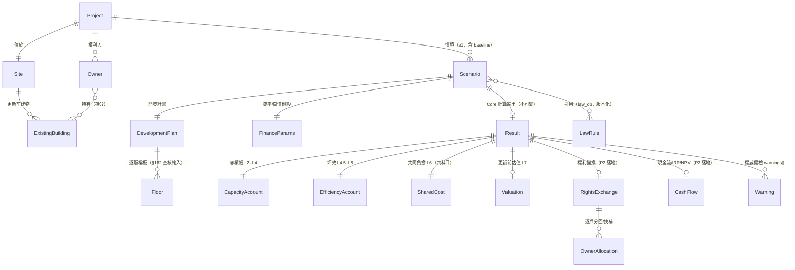

# Urban Renewal OS — Domain Model（v1.0，隨 Architecture Freeze 凍結）

> 範圍裁決見 ARCHITECTURE.md D5：**計算域實體現在定案**；CRM/GIS/Document/AI 只定掛載點。
> 命名慣例（維持既有拍板）：內部 Python 實作可中文（`calc_容積查核`）；本檔實體名與對外
> JSON key 用英文——分界點在 `core/redcf/contract.py`。

---

## 1. ER 圖（計算域）

## 2. 實體定義（計算域）

| 實體 | 關鍵欄位 | 說明／既有對應 |
|---|---|---|
| **Project** | id、name（代號，禁真實案名）、case_type（都更全管/合建/危老/防災）、schema_version | 一案一檔（Project JSON） |
| **Site** | 基地面積（**使照面積**，非謄本——踩坑點#3）、使用分區、容積率、建蔽率、臨路寬 | 現 land 區塊 |
| **ExistingBuilding** | 構造、屋齡、樓層、更新前面積 | 估價輸入（L7）；現為 valuation 參數的一部分 |
| **Owner** | 匿名代號（禁真實姓名）、土地持分、更新前建物面積、consent 狀態、更新前價值 | 現 owners[] 9 欄（v1.1 已定案） |
| **Scenario** | 名稱（baseline/敏感度變體）、獎勵組合、參數覆寫 | **新增實體**：現在「一檔一情境」隱含存在；v2 顯式化，讓敏感度/方案比較有家 |
| **DevelopmentPlan** | 獎勵率拆解、容積移轉、公設比、外皮係數 | 現散在輸入參數 |
| **Floor** | 樓層別、樓板面積、圖說計入、梯廳、安全梯、陽台 | 現逐層表格；**v1.1 合約缺此項＝不可重算的根因**，v2 必補 |
| **FinanceParams** | 營造單價、售價（住/店/車位）、六科目費率、貸款利率年期 | 現 財務率預設＋sidebar 輸入；校準費率＝🔴 級資料 |
| **Result** | core_version、computed_at、input_hash、下列各帳 | 不可變＋溯源（ARCHITECTURE §4） |
| **CapacityAccount** | FA、允建、計入、超出、餘量 | calc_容積查核 輸出 |
| **EfficiencyAccount** | 銷售坪、銷坪比、評效 | calc_坪效/calc_開發評效 |
| **SharedCost** | A–F 六科目＋合計＋共負比 | calc_共同負擔/calc_分回 |
| **Valuation** | 更新前總值、增值倍率 | calc_更新前價值（基礎版，B 級數字） |
| **RightsExchange** | 權值比例表、OwnerAllocation[]（return_value、equalization） | P2；calc_rights_exchange/calc_compensation |
| **CashFlow** | 分期現金流、IRR、NPV、貸款攤還 | P2；calc_cashflow/calc_irr/calc_npv |
| **Warning** | code、message、severity | v1.1 已定；門檻只在 Core |
| **LawRule** | 條號、上限值、適用縣市、來源、更新日期 | law_db；P2 拆 regulation/ 分縣市 |

## 3. OS 模組掛載點（現在不建模，只定關聯規則）

| 模組 | 掛載方式 | 何時建模 |
|---|---|---|
| CRM（整合進度/接觸紀錄） | 自帶檔案，以 `project_id`＋Owner 匿名代號關聯；**真實 PII 永不進版控** | V6 Dashboard 有實際使用場景時 |
| GIS | 自帶圖資引用，以 `project_id` 關聯；計算合約不含座標 | 有圖資來源時 |
| Document Center | 檔案索引（型別/階段/路徑），以 `project_id` 關聯 | V6 |
| AI Context | 只讀 Result JSON＋law_db；**AI 不心算、不落地 PII** | P3，Gate 見 ROADMAP |
| Task/Workflow | S1–S11 階段檢核清單（docs/methodology/開發流程架構.md 為藍本） | V6 |

**掛載規則**（唯一現在就凍結的部分）：模組資料檔自帶 `project_id` 與自己的 schema_version；
計算合約（project.schema.json）**永不**因模組需求而 bump；模組讀 Result 只讀不改。

## 4. 與現況的差距（P1/P2 要補的洞）

1. Floor 不在合約內（v2 必補，D3）。
2. Scenario 隱含而非顯式（v2 顯式化）。
3. Owner 有 schema 無輸入 UI（P2；RE-DCF 技術債清單第 1 條）。
4. RightsExchange/CashFlow 有欄位規格、無計算函式（P2）。
5. `models/` dataclass 尚未存在——目前 dict 傳遞。**裁決**：dataclass 化排 P1 低優先，
   只在「新增 rights/cashflow 時」順勢引入新實體的 dataclass，不回頭大改既有 dict 介面
   （回頭改＝高風險零使用者價值，違反「搬家不是改建」精神）。
